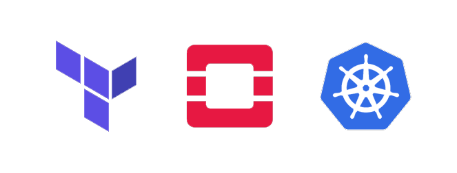
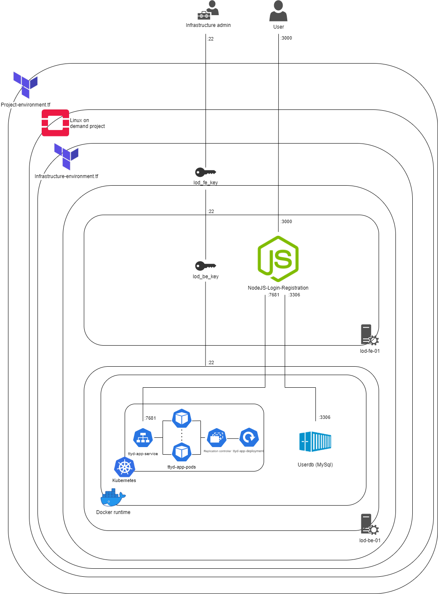
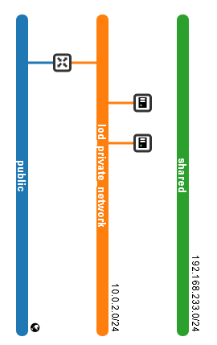

<!-- PROJECT LOGO -->
<p align="center">
    <!--  -->
 
  <h3 align="center">A Cloud infrastructure that provide Linux on Demand</h3>
</p>
<p align="center">
Project A.Y. 2020-21 University of Trento, Italy
  <br/>
  <br/>
<a href="https://github.com/SuperboGiuseppe/linux-on-demand/issues">
</a>
<a href="https://github.com/SuperboGiuseppe/linux-on-demand/network">
</a>
<a href="https://github.com/SuperboGiuseppe/linux-on-demand/stargazers">
</a>
<a href="https://github.com/SuperboGiuseppe/linux-on-demand">
</a>
</p>
<br />

<!-- TABLE OF CONTENTS -->
## Table of Contents

* [About the Project](#about-the-project)
  * [Architecture](#Architecture)
  * [Built With](#built-with)
* [Getting Started](#getting-started)
  * [Prerequisites](#prerequisites)
  * [Installation](#installation)
* [Usage](#usage)
* [Documentation](https://easybase.io/docs/easybase-react/)
* [Examples](#examples)
* [Troubleshoot](#troubleshoot)
* [License](#license)
* [Contact](#contact)


<!-- ABOUT THE PROJECT -->
## About The Project
In this project, we are going to design and configure an infrastructure that hosts several development web applications, especially for computer
science/engineering students. In order to configure the necessary infrastructure assets, we are going to use OpenStack as our IaaS
platform. In addition to this, we are going to adopt Docker and Kubernetes PaaS solutions to deploy the required containerized web
applications.

### Architecture
The main OpenStack service used for this infrastructure is **Nova**,
which is used for the server instances. These instances are based on
different OS images, depending on their main functionality. In addition
to this, additional necessary applications/packages will be installed in
each instance.

**Infrastructure Design** as you can see in the image given below.



Servers security is based on the ”Security Group” concept, which is
similar to Firewall rule set but is applied on a group of servers level.
Both the inbound and outbound traffic are filtered by the Security
Group. Only defined ports and IPs are enabled to incoming traffic, as
well as defined ports are enabled in outbound connections. Traffic is
permitted on a need bases.

**Networking**
The base OpenStack service that creates the structure of the network
subnets that acts like a container for the instances is **Neutron**. It
is possible to create a dedicated network for the instances of the
project. In this case the network is labeled ”edu-private-network-01”
and any server created will be placed in this network. Different subnets
can be allocated in the network. For this project a single private
subnet labeled “edu-private-network-subnet-01” is allocated.



| Subnet name                   | Network subnet | Public/Private | Gateway IP |
|-------------------------------|----------------|----------------|------------|
| lod-private-network-subnet-01 | 10.0.2.0/24    | Private        | 10.0.1.1   |


Private subnet is restricted only to be accessible through the dedicated
router interface between private project network and public network. The
router named ”edu-router-01” is connected to the private subnet through
an interface. In this way it is possible to reach public internet from
the subnet and viceversa when allocating a floating IP.

| Router name   | Availability zone | Interface                                 | Gateway IP |
|---------------|-------------------|-------------------------------------------|------------|
| lod-router-01 | Nova              | Public <--> lod-private-network-subnet-01 | 10.0.1.1   |

**Asset inventory**
This section will describe the servers from the hardware and software
point of view. The table below summarises the hardware resources of the
servers in place for the project.

| Host      | Flavor    | Number of vCpus | RAM | Storage | OS Image     | Floating IP |
|-----------|-----------|-----------------|-----|---------|--------------|-------------|
| lod-bh-01 | m1.small  | 1               | 2GB | 20GB    | Ubuntu 18.04 | Yes         |
| lod-fe-01 | m1.small  | 1               | 2GB | 20GB    | Ubuntu 18.04 | Yes         |
| lod-be-01 | m1.medium | 2               | 4GB | 40GB    | Ubuntu 18.04 | No          |
| lod-db-01 | m1.small  | 1               | 2GB | 20GB    | Ubuntu 18.04 | No          |

**Bastion Host (edu-bh-01)**
This instance has the purpose of providing access to a private network
from the public network. Its scope is to minimize the chance of
penetration and so strict firewall rules are required to be applied. For
this reason a floating IP is associated to this instance and the only
port reachable from public network is 22, as only SSH connection will be
possible from the floating IP. Naturally only the known hosts will be
authorized to access the private network through the exchange of public
and private keys. From the bastion host it will be possible to reach the
other project instances from their private IP addresses.

**Front-end (edu-fe-01)**
The front-end instance is in charge of hosting the WEB Interface for the
final user. For this reason **Nginx** will be installed during the
creation of the instance in order to configure a web server. In order to
expose the web server content to the public internet it is necessary to
associate a floating IP. The content will be reachable only through
HTTP/HTTPS protocol (Ports 80 and 443). All the services prompted by the
front-end are hosted in the back-end, and the user can access them only
if it is registered to the platform with a private profile.

**Back-end (edu-be-01)**
The back-end instance is the core of the project as all the main web
applications are executed here. In order to make educational
applications available, docker PaaS set of service will be installed
along with the docker engine. In this way we will deploy the following
containers:

| Application | Description                                             | Link                                                                       |
|-------------|---------------------------------------------------------|----------------------------------------------------------------------------|
| SSHwifty    | SSHwifty is a SSH and Telnet connector made for the web | [SSHwifty repository](https://github.com/nirui/sshwifty)                   |
| Paperless   | PDF documents manager                                   | [Paperless repository](https://github.com/the-paperless-project/paperless) |
| Code-Server | Visual studio code IDE on WEB                           | [Code-Server repository](https://github.com/cdr/code-server)               |

In addition to these docker container applications, kubernetes
environment will be installed and configured in this instance as it is
necessary to manage a dynamic cluster of pods. For this reason a
kubernetes deployment will be configured along its replication set of
pods. These pods are going to be offered to the users as Linux
environment sandbox. For this reason the user can create and access a
pod whenever he needs to learn some Linux bash commands. Thanks to
SSHwifty the user will be able to establish an SSH connection with the
private pod directly via browser. All the pods will be based on standard
Ubuntu image.

User profiles management will be managed by the back-end through the
3306 port from which it is possible to communicate with the
infrastructure database (edu-db-01).

**Database (edu-db-01)**
In the database we will have all the details of user profiles. The user
can access the services only if authorized by his credentials, which are
stored in this database. For this reason mysql-server package will be
installed in order to store a relational database in the root volume of
this instance.

**DevOps**
In order to automate the development process we are going to use
Terraform as our infrastructure as a code software tool. In this way all
the infrastructure components are configured and managed in a structured
way. Additionally, thanks to this IaaS tool, it is possible to see if
any edit can affect the deployed components, before applying those
changes. All the assets required for the deployment and the
configuration of this project will be released in the following GitHub
repository: <https://github.com/SuperboGiuseppe/education-on-demand>.

### Built With

* [Terraform](https://www.terraform.io/)
* [OpenStack](https://www.openstack.org/)
* [kubernetes](https://kubernetes.io/)
* [Docker](https://www.docker.com/)


<!-- GETTING STARTED -->
## Getting Started

### Prerequisites

* pendding
* pendding

### Installation

```sh
bla bla bla
```

### Database
#### Create of Project

### Cloud Functions

#### Deploy a new cloud function


## Usage


### Cloud Functions


<!-- DOCUMENTATION -->
## Documentation


<!-- EXAMPLES -->
## Examples


<!-- TROUBLESHOOT -->
## Troubleshoot


<!-- LICENSE -->
## License

Distributed under the MIT License. See `LICENSE` for more information.

<!-- CONTACT -->
## Contact

| Name           | Surname | E-mail                                    | Github repository                  |
|----------------|---------|-------------------------------------------|------------------------------------|
| Giuseppe       | Superbo | giuseppe.superbo97_at_gmail.com           | https://github.com/SuperboGiuseppe |
| Muhammad Uzair | Aslam   | muhammaduazair.aslam_at_studenti.unitn.it | https://github.com/uzairali37      |


