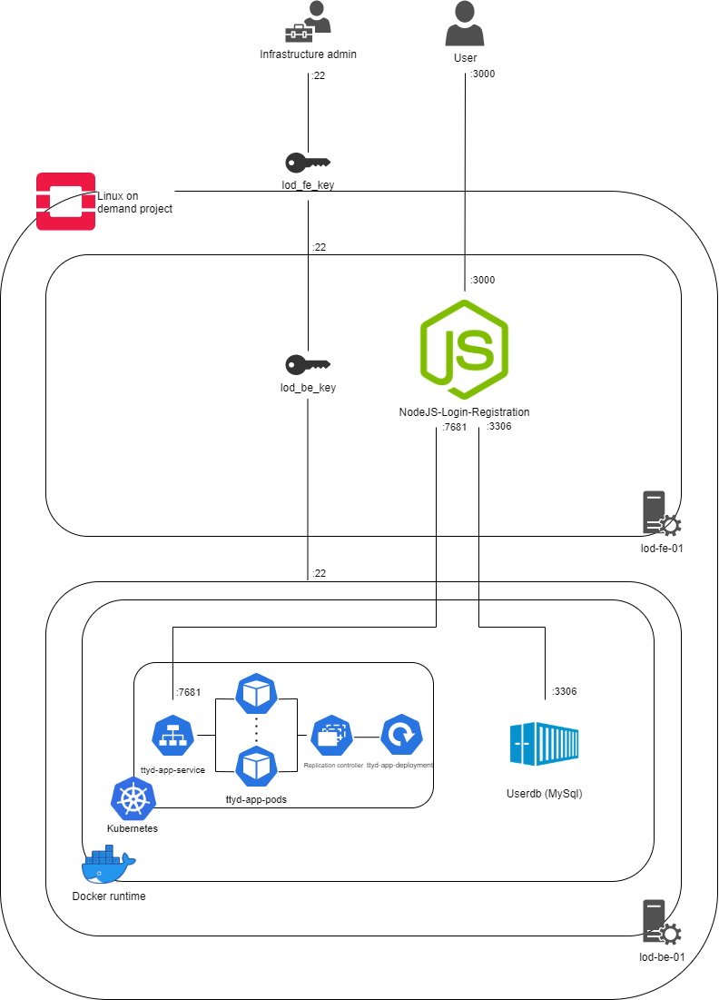

<!-- PROJECT LOGO -->
<p align="center">
    <!--  -->
 
  <h3 align="center">A Cloud infrastructure that provide Linux on Demand</h3>
</p>
<p align="center">
Fog and Cloud Computing Project A.Y. 2020-21 University of Trento, Italy
  <br/>
  <br/>
<a href="https://github.com/SuperboGiuseppe/linux-on-demand/issues">
</a>
<a href="https://github.com/SuperboGiuseppe/linux-on-demand/network">
</a>
<a href="https://github.com/SuperboGiuseppe/linux-on-demand/stargazers">
</a>
<a href="https://github.com/SuperboGiuseppe/linux-on-demand">
</a>
</p>
<br />

<!-- TABLE OF CONTENTS -->
## Table of Contents

* [About the Project](#about-the-project)
  * [Architecture](#Architecture)
  * [Built With](#built-with)
* [Getting Started](#getting-started)
  * [Prerequisites](#prerequisites)
  * [Installation](#installation)
* [Usage](#usage)
* [License](#license)
* [Contact](#contact)


<!-- ABOUT THE PROJECT -->
## About The Project
In this project, we have designed and configure an infrastructure that hosts a Linux virtual sandbox environment. In order to configure the necessary infrastructure assets, we have used OpenStack as our IaaS platform. In addition to this, we have adopted Docker and Kubernetes PaaS solutions to deploy the required containerized application and most importantly to automized all the platform we have used the terraform from hashicorp.

### Architecture
The architecture of the platform is really straightforward. As you can see in the figure down below. We have explained it step by step. The main OpenStack service used for this infrastructure is **Nova**, which is used for the server instances. These instances are based on different OS images, depending on their main functionality. In addition
to this, additional necessary applications/packages will be installed in each instance.

**Infrastructure Design** as you can see in the image given below.



According to the available resources, we have created the instances: ‘lod-fe-01’, in Openstack which acts also as a bastion host of the infrastructure, meanwhile "lod-be-01" hosts a MySQL docker container that acts as the database of the infrastructure.

Servers security is based on the ”Security Group” concept, which is similar to Firewall rule set but is applied on a group of servers level. Both the inbound and outbound traffic are filtered by the Security Group. Only defined ports and IPs are enabled to incoming traffic, as well as defined ports are enabled in outbound connections. Traffic is
permitted on a need bases.

**Networking**
The base OpenStack service that creates the structure of the network
subnets that acts like a container for the instances is **Neutron**. It
is possible to create a dedicated network for the instances of the
project. In this case the network is labeled ”edu-private-network-01”
and any server created will be placed in this network. Different subnets
can be allocated in the network. For this project a single private
subnet labeled “edu-private-network-subnet-01” is allocated.


| Subnet name                   | Network subnet | Public/Private | Gateway IP |
|-------------------------------|----------------|----------------|------------|
| lod-private-network-subnet-01 | 10.0.2.0/24    | Private        | 10.0.1.1   |


Private subnet is restricted only to be accessible through the dedicated
router interface between private project network and public network. The
router named ”edu-router-01” is connected to the private subnet through
an interface. In this way it is possible to reach public internet from
the subnet and viceversa when allocating a floating IP.

| Router name   | Availability zone | Interface                                 | Gateway IP |
|---------------|-------------------|-------------------------------------------|------------|
| lod-router-01 | Nova              | Public <--> lod-private-network-subnet-01 | 10.0.1.1   |

**Asset inventory**
This section will describe the servers from the hardware and software
point of view. The table below summarises the hardware resources of the
servers in place for the project.

| Host      | Flavor    | Number of vCpus | RAM | Storage | OS Image     | Floating IP |
|-----------|-----------|-----------------|-----|---------|--------------|-------------|
| lod-fe-01 | m1.small  | 1               | 2GB | 20GB    | Ubuntu 18.04 | Yes         |
| lod-be-01 | m1.medium | 2               | 4GB | 40GB    | Ubuntu 18.04 | No          |

**Front-end (edu-fe-01)**
The front-end instance is in charge of hosting the WEB Interface for the final user. Originally we wanted to configure the webserver with **Nginx**. However, in order to avoid all the problems related to the complex configuration of *Nginx*, we adopted a complete **nodejs** web application [nodejs-login-registration repository](https://github.com/SuperboGiuseppe/nodejs-login-registration) that could satisfy our requirements. This nodejs application exposes a login/registration prompt through port 3000. All the users' accounts are saved in the DB located in lod-be-01 as a docker MySQL container reachable from port 3306. Once the user has been authorized, he can access the Linux sandbox which is a Kubernetes service hosted also on lod-be-01 and reachable from port 7681.
In addition to the web application, this instance has also the purpose of providing access to a private network from the public network.  For this reason, a floating IP is associated with this instance, and system administrators can establish an ssh connection with lod-be-01 through lod-fe-01.

**Back-end (edu-be-01)**
The back-end instance is the core of the project as the core web application is executed here. In order to make the Linux sandbox environment available, a Kubernetes deployment and service are configured. Each pod of the deployment is part of a replica set and a service exposes each pod of the deployment through port 7681. All the pods of the deployment are based on the official docker image of the ttyd project [TTYD repository website](https://tsl0922.github.io/ttyd/). Ttyd is a simple web terminal app that lets authorized users access pods. In this way, the user can play around with a Linux sandbox environment directly from the browser.


In addition to these docker container applications, kubernetes environment will be installed and configured in this instance as it is necessary to manage a dynamic cluster of pods. For this reason a kubernetes deployment will be configured along its replication set of pods. These pods are going to be offered to the users as Linux
environment sandbox. For this reason the user can create and access a pod whenever he needs to learn some Linux bash commands. Thanks to SSHwifty the user will be able to establish an SSH connection with the private pod directly via browser. All the pods will be based on standard Ubuntu image. User profiles management will be managed by the back-end through the 3306 port from which it is possible to communicate with the infrastructure database (edu-db-01).

**DevOps**
In order to automate the development process as we have discussed before. We have used Terraform as our infrastructure as a code software tool. In this way, all the infrastructure components are configured and managed in a structured way. Additionally, thanks to this IaaS tool, it is possible to see if any edit can affect the deployed components, before applying those changes.
All the assets required for the deployment and the configuration of this project will be released in the following [GitHub repository](https://github.com/SuperboGiuseppe/education-on-demand).

### Built With
* [Terraform](https://www.terraform.io/)
* [OpenStack](https://www.openstack.org/)
* [kubernetes](https://kubernetes.io/)
* [Docker](https://www.docker.com/)


<!-- GETTING STARTED -->
## Getting Started
In order to get benefits from this project, you need to fulfill some prerequisites that are listed below.
### Prerequisites

* You need to install [OpenStack](https://www.openstack.org/), OpenStack can be managed with a Command-line interface (CLI) and Graphical user interface. But here we have used [Terraform](https://www.terraform.io/) to automize our whole installation it's a powerful tool you can explore more about it from [hashicorp](https://www.hashicorp.com/). 
* In order to run the applications on OpenStack instance you need to install also [kubernetes](https://kubernetes.io/), [Docker](https://www.docker.com/) on your machine which you are intended to use for the platform to run.

### Installation
Once you have finished with the prerequisites installation you can use the script inside the [GitHub repository](https://github.com/SuperboGiuseppe/education-on-demand) and you can follow these commands to initialize your infrastructure. You can also modify the script according to your need.

```sh
Main commands:
  terraform init          Prepare your working directory for other commands
  terraform validate      Check whether the configuration is valid
  terraform plan          Show changes required by the current configuration
  terraform apply         Create or update infrastructure
  terraform destroy       Destroy previously-created infrastructure
```
## Usage
This project can be used for any purpose.

<!-- LICENSE -->
## License

Distributed under the MIT License. See `LICENSE` for more information.

<!-- CONTACT -->
## Contact

| Name           | Surname | E-mail                                    | Github repository                  |
|----------------|---------|-------------------------------------------|------------------------------------|
| Giuseppe       | Superbo | giuseppe.superbo97_at_gmail.com           | https://github.com/SuperboGiuseppe |
| Muhammad Uzair | Aslam   | muhammaduazair.aslam_at_studenti.unitn.it | https://github.com/uzairali37      |


